# Proof of Concept: Static Website Hosting on S3 with Route 53 and GitHub Actions

This project serves as a proof of concept for hosting a static website on Amazon S3, coupled with Route 53 for domain management. The deployment process is automated using GitHub Actions, providing a continuous integration and continuous deployment (CI/CD) solution.

## Table of Contents

- [Proof of Concept: Static Website Hosting on S3 with Route 53 and GitHub Actions](#proof-of-concept-static-website-hosting-on-s3-with-route-53-and-github-actions)
  - [Table of Contents](#table-of-contents)
  - [Overview](#overview)
  - [Prerequisites](#prerequisites)
  - [Setup](#setup)
    - [1. Amazon S3 Configuration](#1-amazon-s3-configuration)
    - [2. Route 53 Configuration](#2-route-53-configuration)
    - [3. GitHub Actions](#3-github-actions)
  - [Usage](#usage)

## Overview

This project demonstrates how to host a static website on Amazon S3 and associate it with a custom domain using Route 53. GitHub Actions automate the process of deploying changes to the S3 bucket whenever updates are pushed to the repository.

## Prerequisites

Before you begin, ensure you have the following in place:

- An AWS account with necessary permissions to create and manage S3 buckets and Route 53 hosted zones.
- A registered domain on Route 53 or another DNS provider.
- GitHub repository containing your static website files.

## Setup

### 1. Amazon S3 Configuration

- Create an S3 bucket to store your static website files.

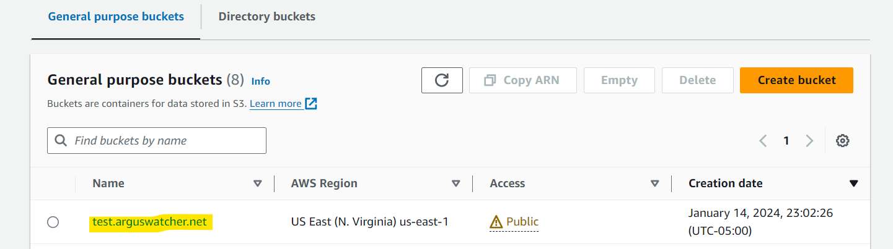

- Configure the bucket for static website hosting.
  - Enable versioning
  - Unblock public access
  - update policy
  - Enable static web hosting

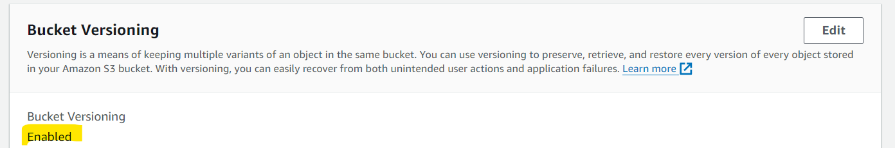

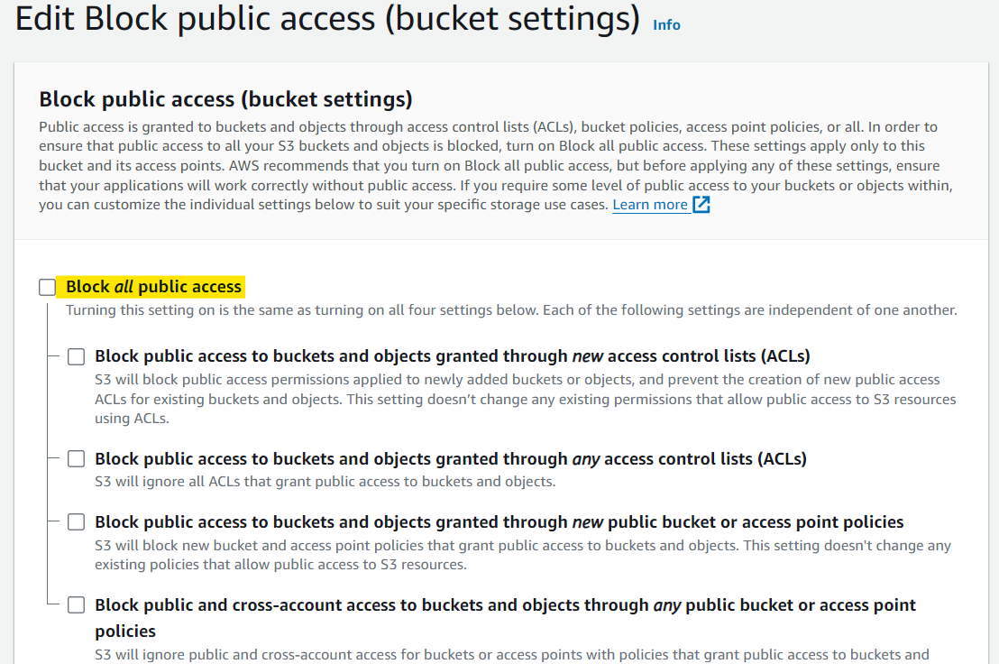

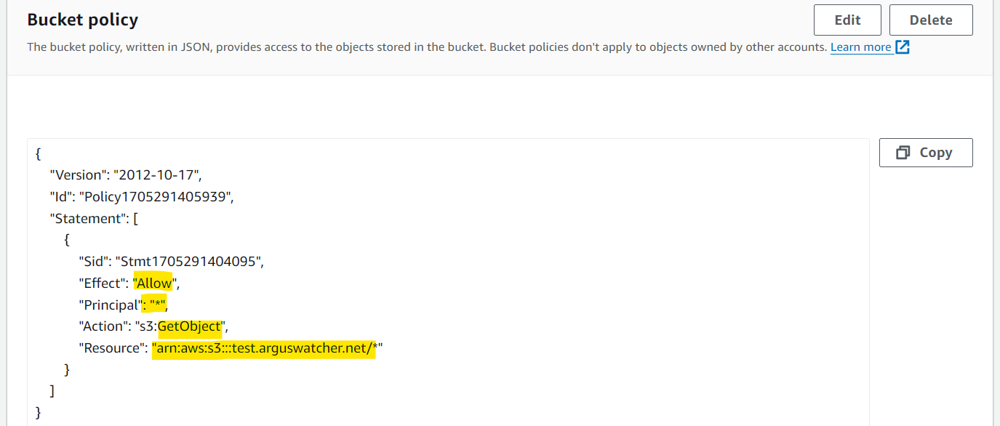

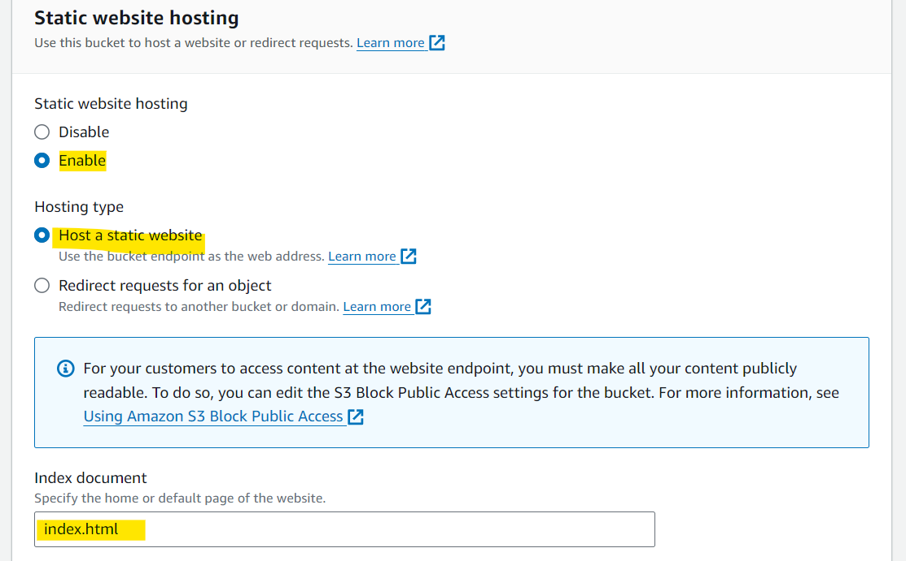

---

### 2. Route 53 Configuration

- Create a hosted zone for your domain on Route 53.
- Update the domain's nameservers to those provided by Route 53.

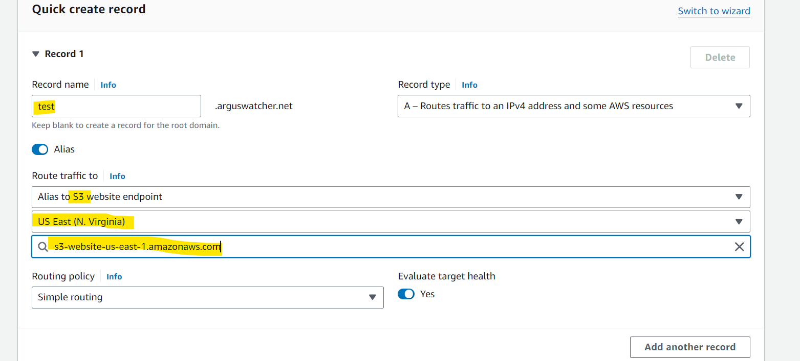

---

### 3. GitHub Actions

- Set up GitHub Actions workflows to automate the deployment process.
  - Create a new directory named `.github` within root
  - Create a new directory named `workflows` within `.github`
  - Create `main.yml` configuration file.

```yaml
# Action name
name: Upload Website

# condition
# whenever push on the master branch
on:
  push:
    branches:
      - master

jobs:
  deploy:
    runs-on: ubuntu-latest
    steps:
      - name: Checkout
        uses: actions/checkout@v1
        # use the AWS CLI
      - name: Configure AWS Credentials
        uses: aws-actions/configure-aws-credentials@v1
        # fetches values from the secrets
        with:
          aws-access-key-id: ${{ secrets.AWS_ACCESS_KEY_ID }}
          aws-secret-access-key: ${{ secrets.AWS_SECRET_ACCESS_KEY }}
          # along with bucket name
          aws-region: us-east-1

      - name: Deploy static site to S3 bucket
        # aws s3 sync: Recursively copies new and updated files from the source directory to the destination
        # ensure the target bucket name is correct
        run: aws s3 sync ./web_files/ s3://test.arguswatcher.net --delete
```

- Define secrets in your repository for AWS credentials to enable secure communication with your AWS resources.

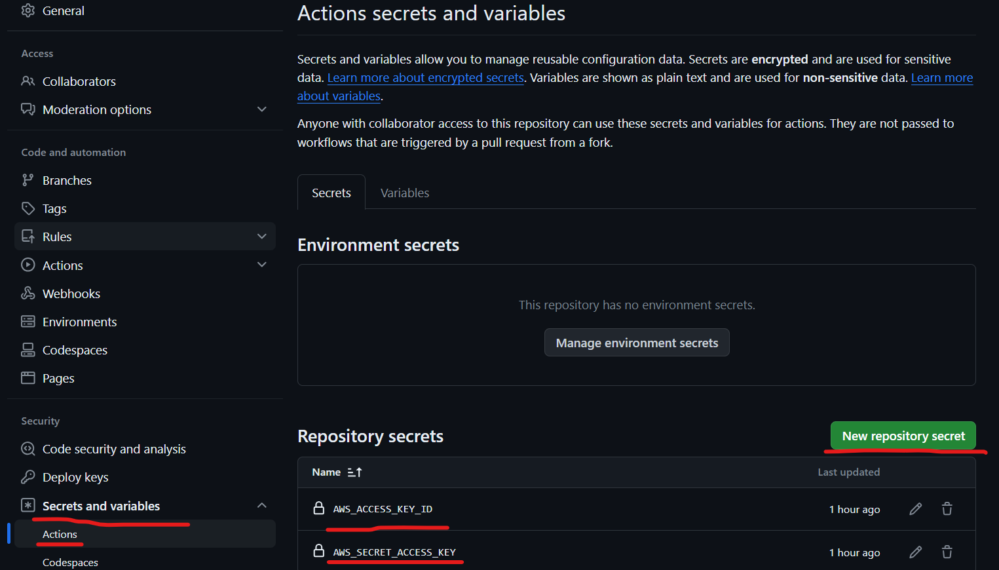

---

## Usage

1. Create static website files.

   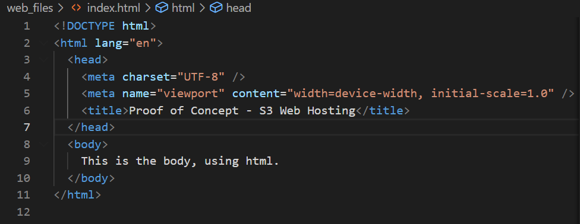

2. Push changes to the GitHub repository.

   ```bash
   git add .
   git commit -m "initail commit"
   git push
   ```

3. GitHub Actions will automatically deploy the updated files to the S3 bucket.

   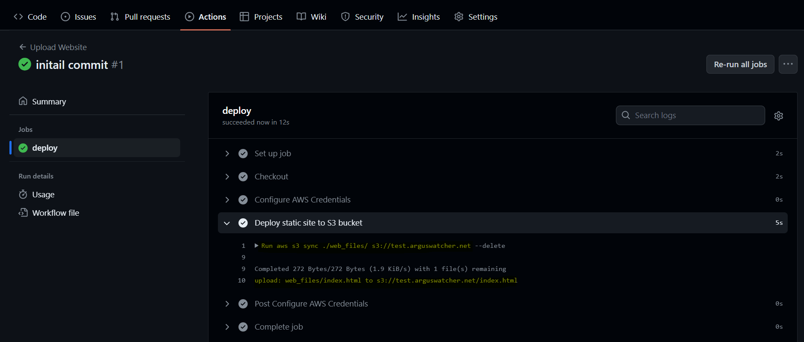

4. Verify on Domain Name

   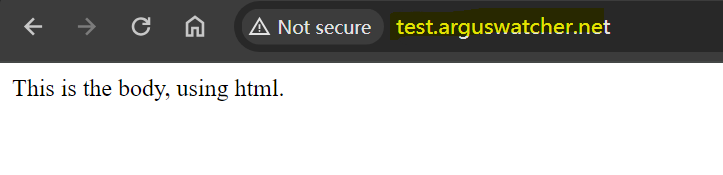

5. Make some changes to the index.html file

   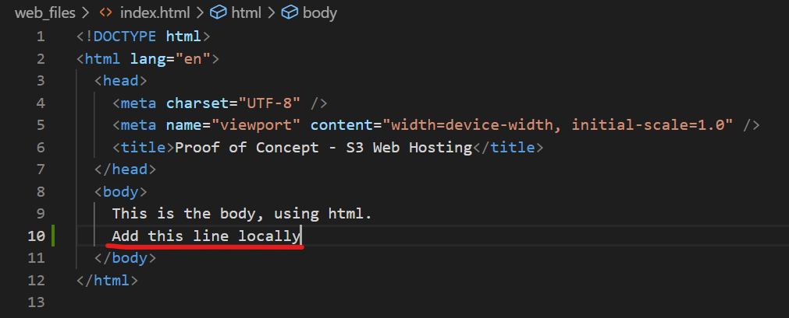

6. Commit and push
7. Check update on Domain Name

---

[TOP](#proof-of-concept-static-website-hosting-on-s3-with-route-53-and-github-actions)
